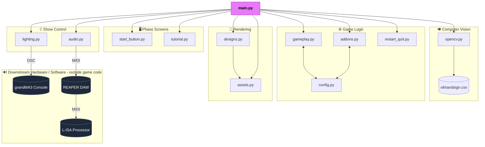
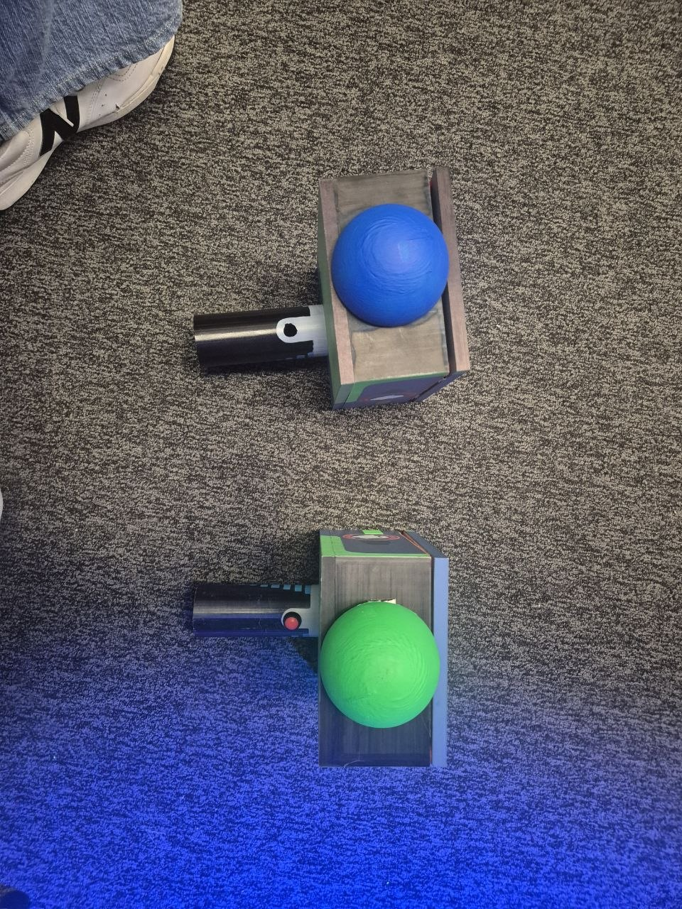
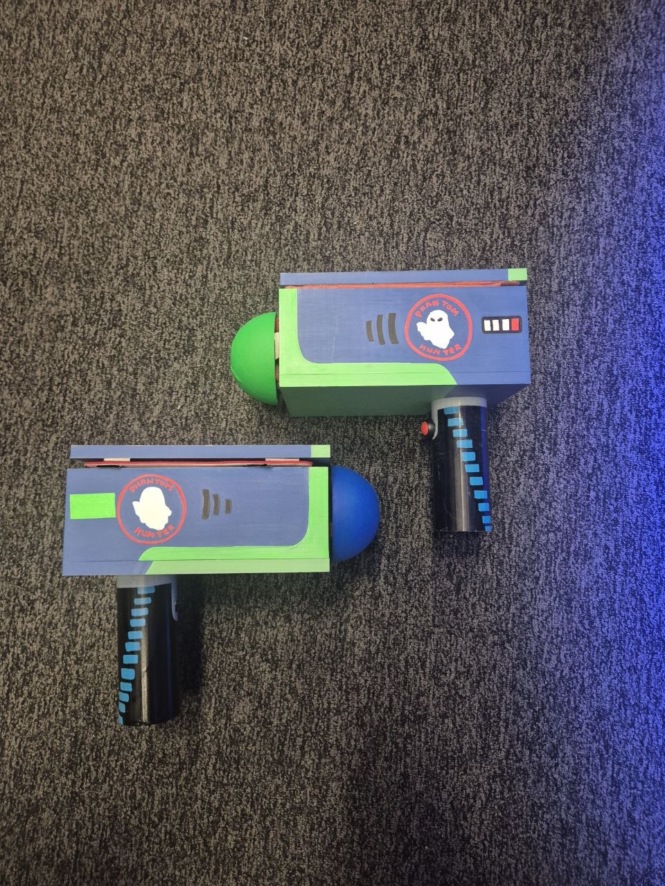

# EGL314
## Phantom Sweep OpenCV + MediaPipe Game (MVP)  
An interactive game developed in python that integrates OpenCV and Mediapipe (Real time hand/colour tracking), GrandMA3 lighting fixtures and wall mounted speakers via L-ISA and Reaper.

---

## Table of Contents
- [1. Setup]
    - [1.1 Create Conda environment]
    - [1.2 Install this in your terminal] 
- [2. Installing your dependencies]
    - [2.1 What each dependency does]
- [3. Game Files]
    - [3.1 Game Flow]
- Notes

## 1. Setup
---
## 1.1 Create Conda environment
The Conda environment acts as a dedicated workshop for our 'Phantom Sweep' game, ensuring that the specific versions of OpenCV, MediaPipe, and other tools you need are kept isolated so they don't crash or conflict with other projects on your computer.

### 1.2 Install this in your terminal
```bash
conda create --name <env_name> python=3.10.0
conda activate <env_name>
```
---
## 2. Installing your dependencies
Dependencies are like pre-manufactured parts—like circuit boards or sensors—that you'd buy from a hardware store instead of building them from scratch, allowing our team to focus on designing the game logic rather than reinventing the fundamental tools for vision and input.

## 2.1 What each dependency does:
| Dependency | Role in the game |
| :--- | :--- |
| `opencv-python` | Handles video capture from your webcam and detects your hand or, in this case colour. |
| `mediapipe` | Detects your hand landmarks in real-time. |
| `numpy` | Performs high-speed math to calculate distances/coordinates. |
| `pyautogui` | Simulates mouse/keyboard actions (e.g., "clicking" on a ghost). |
| `pynput` | Monitors keyboard/mouse input if you need custom hotkeys. |
| `pygrabber` | It helps your computer see all the cameras plugged into it, so you can pick the right one for your game, eg: you have a built-in webcam and a external usb webcam connected to your computer. |
| `python-osc` | Enables communication with other software or hardware via OSC protocols. |

### Create a text file and name it requirements.txt and paste in the following:
```bash
opencv-python
mediapipe==0.10.9
pyautogui
pynput
numpy
pygrabber
python-osc==1.8.1
```
### Install this in your terminal after creating requirements.txt:
``` bash
pip install -r requirements.txt
```

## 3. Game Files
| File | Description |
| :--- | :--- |
| `addons.py` | Handles secondary mechanics: Gesture loading bars, decoy logic, difficulty ramping. |
| `audio.py` | Bridges the game to REAPER and L-ISA via Open Sound Control (OSC) to trigger sounds and transport controls. |
| `config.py` | The central hub where the game's settings, such as screen dimensions, colour codes and difficulty levels are stored. |
| `designs.py` | The visual rendering engine; draws backgrounds, particles, character and UI elements. |
| `gameplay.py` | Manages core game rules: hit detection, movement intervals, scoring and entity states.|
| `lighting.py` | Acts as a DMX/GrandMA3 lighting controller, sending OSC commands for visual effects. |
| `main.py` | This file contains the main .py file that uses each .py file to create the game. |
| `opencv.py` | Processes webcam frames, handles colour tracking and evaluates hand gesture geometry |
| `okhandsign.csv` | Originally meant for thumbs up gestures but configured to recognise an OK sign for easier hand landmark recognition. |
| `ok hand sign.png` | Image to show users what hand sign to hold out. |
| `requirements.txt` | This file contains the dependencies mentioned earlier. |
| `restart_quit.py` | Handles end-game state resets and renders the game-over result screen. |
| `start_button.py`| Manages the interaction logic for the game's startup menu. |
| `tutorial.py` | Renders the instructional and tutorial logic for the game's startup menu | 
| `webcam_test.py`| A standalone tool to verify webcam connectivity. |

## 3.1 Game flow
# Phantom Sweep — Architecture



## Notes

- **`main.py`** is the single entry point and orchestrator — it owns the game loop, phase state machine, and calls into every active module every frame.
- **`lighting.py`** and **`audio.py`** each open their **own direct OSC connection** to their hardware target (grandMA3 and REAPER respectively) rather than routing through a shared hub.
- **`webcam_test.py`** is a standalone manual test script for verifying camera connectivity — it is not imported or called by `main.py`.
- **`okhandsign.csv`** (referenced by `opencv.py` as `okhandsign.csv`) stores reference hand-landmark vectors used for OK-sign gesture matching.


 ### [Click here to view the README for each .py file for more details.](POC/Documentation/)
 ### [Click here to view the README for the MVP documents and .py files. All related files can be found here.](MVP/Documentation/)

## What you'll need:
1. Webcam (Built-in/ external)
2. Laptop monitor/ External monitor
3. Dome shaped objects painted in fluorescent acrylic green and blue.

Currently, our team collaborated with other teams to create props that can be passed down from station to station. Our contribution is the green and blue shaped dome on the front of the blasters as seen below.

### [Click here to view the STL files for 3D printing](MVP/Documentation/Assets/)





## Connections to GrandMA3/Reaper + L-ISA


```bash
GMA3_IP   = "192.168.254.252"
GMA3_PORT = 8080
GMA3_ADDR = "/gma3/cmd"
```

This is the network address of the lighting console. Every command sent by this file goes to this IP, port, and OSC channel. If the console moves to a different machine, this is the only place that needs to change.

xxx
